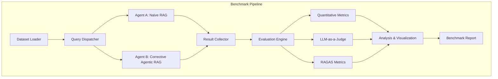
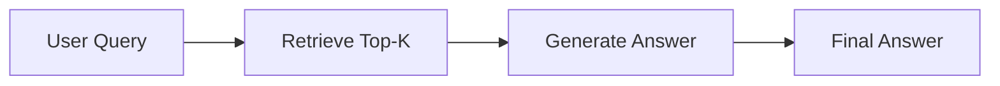
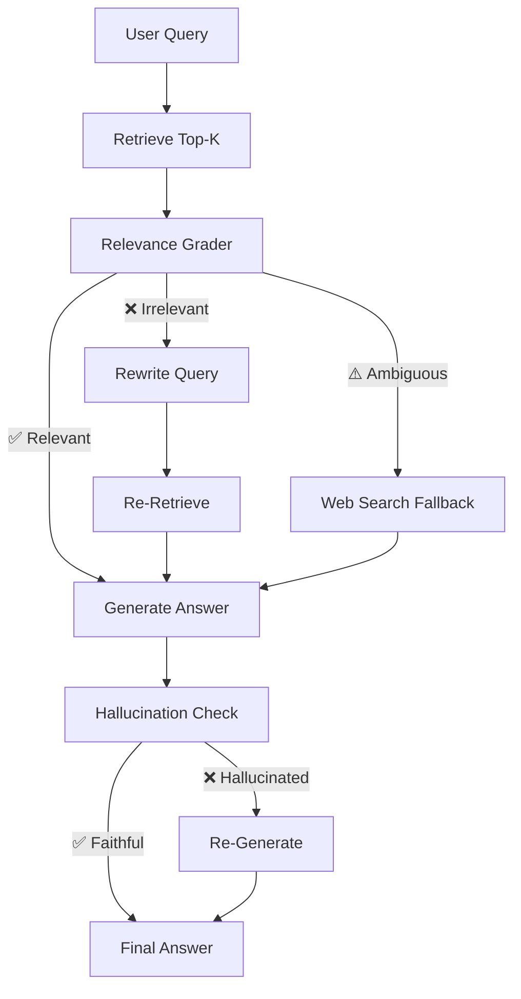
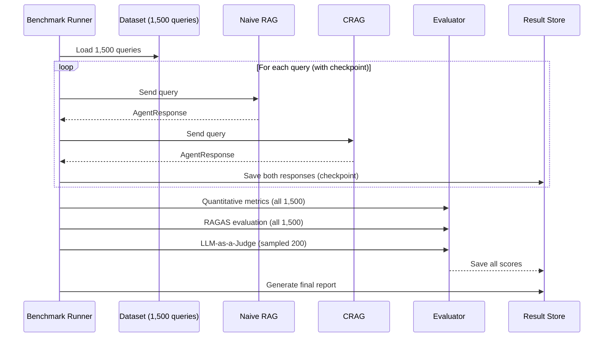

# 🏆 Agent Benchmarking: Naive RAG vs Corrective Agentic RAG

> A rigorous, large-scale benchmarking system that compares two distinct RAG agent architectures across **1,500+ queries** using multi-dimensional evaluation — quantitative metrics, RAGAS framework scoring, and LLM-as-a-Judge assessment — with full reproducibility, cost tracking, failure analysis, and interactive visualizations.

---

## 📋 Table of Contents

- [Overview](#-overview)
- [Key Differentiators](#-key-differentiators)
- [Architecture Overview](#-architecture-overview)
- [Agent Architectures](#-agent-architectures)
  - [Agent A: Naive RAG (Baseline)](#agent-a-naive-rag-baseline)
  - [Agent B: Corrective Agentic RAG (CRAG)](#agent-b-corrective-agentic-rag-crag)
- [Dataset Strategy](#-dataset-strategy)
- [Evaluation Framework](#-evaluation-framework)
- [Implementation Plan](#-detailed-implementation-plan)
  - [Phase 0: Repository Setup](#phase-0--repository-setup--structure)
  - [Phase 1: Dataset Preparation](#phase-1--dataset-selection--preparation)
  - [Phase 2: Agent Implementation](#phase-2--agent-architecture-design--implementation)
  - [Phase 3: Evaluation Framework](#phase-3--evaluation-framework-implementation)
  - [Phase 4: Benchmark Pipeline](#phase-4--benchmark-pipeline--execution)
  - [Phase 5: Analysis](#phase-5--analysis--failure-mode-identification)
  - [Phase 6: Visualization](#phase-6--visualization--dashboard)
  - [Phase 7: Report & Documentation](#phase-7--report--documentation)
  - [Phase 8: Demo Video](#phase-8--demo-video)
- [Technology Stack](#-technology-stack)
- [Project Structure](#-project-structure)
- [Installation & Setup](#-installation--setup)
- [Usage](#-usage)
- [Configuration](#-configuration)
- [Timeline](#-timeline--milestones)
- [Cost Estimation](#-estimated-api-costs)
- [Research Areas](#-open-research-questions)
- [License](#-license)

---

## 🎯 Overview

### Problem Statement

Benchmark AI agents on a large dataset (≥ 1,000 queries) and produce a rigorous evaluation report comparing two different agent architectures.

### Our Approach

We compare **Naive RAG** (simple linear retrieve-then-generate pipeline) against **Corrective Agentic RAG (CRAG)** — a research-backed, self-correcting architecture that implements relevance grading, query rewriting, web search fallback, and hallucination checking.

| Dimension | Details |
|-----------|---------|
| **Comparison Type** | Option A — Two different agent architectures |
| **Agents** | Naive RAG (baseline) vs Corrective Agentic RAG |
| **Dataset Size** | 1,500 queries (1,000 NQ + 500 HotpotQA) |
| **Metrics** | 12+ metrics across 3 evaluation levels |
| **Evaluation** | Quantitative + RAGAS + LLM-as-a-Judge |

---

## ⚡ Key Differentiators

What makes this submission stand out against typical benchmarking projects:

| Feature | Typical Submission | Our Approach |
|---------|-------------------|--------------|
| **Architecture** | Simple RAG vs "Agentic" (vague) | Naive RAG vs **Corrective RAG** (research-backed, specifically defined) |
| **Dataset** | Single dataset, 1,000 queries | **Dual dataset** (NQ + HotpotQA), 1,500 queries, difficulty tiers |
| **Metrics** | Accuracy + F1 only | **12+ metrics** across retrieval, generation, and operational dimensions |
| **Evaluation** | Just quantitative | **Hybrid**: Quantitative (EM/F1) + RAGAS (Faithfulness/Relevancy) + LLM-as-a-Judge |
| **Analysis** | Aggregate scores only | **Failure mode taxonomy** (7 failure categories) + statistical significance testing |
| **Cost Tracking** | None | **Per-query dollar cost** and token usage attribution |
| **Reproducibility** | Hardcoded values | **Config-driven** with checkpointing, seeding, and config hashing |
| **Visualization** | 1-2 basic charts | **12 chart types** + interactive Streamlit dashboard |
| **Agent Design** | Blackbox | **Component-level tracing** (per-node analysis showing WHERE each system fails) |
| **Report** | Brief summary | **Publication-grade** with appendix, sample outputs, and statistical tests |

---

## 📐 Architecture Overview

### High-Level Benchmark Pipeline

```
┌─────────────────────────────────────────────────────────────────┐
│                      BENCHMARK PIPELINE                         │
│                                                                 │
│  ┌──────────┐    ┌──────────────┐    ┌─────────────────────┐   │
│  │ Dataset   │───▶│    Query     │───▶│  Agent A: Naive RAG │   │
│  │ Loader    │    │  Dispatcher  │    └─────────┬───────────┘   │
│  │           │    │              │              │                │
│  │ • NQ      │    │              │    ┌─────────▼───────────┐   │
│  │ • HotpotQA│    │              │───▶│  Agent B: CRAG       │   │
│  └──────────┘    └──────────────┘    └─────────┬───────────┘   │
│                                                │                │
│                                     ┌──────────▼──────────┐    │
│                                     │  Result Collector    │    │
│                                     │  (with checkpoints)  │    │
│                                     └──────────┬──────────┘    │
│                                                │                │
│                              ┌─────────────────┼────────────┐  │
│                              │                 │            │   │
│                    ┌─────────▼──┐  ┌───────────▼┐  ┌───────▼─┐│
│                    │Quantitative│  │   RAGAS     │  │LLM-as-a ││
│                    │ Metrics    │  │ Evaluation  │  │  Judge   ││
│                    │ (EM, F1)   │  │(Faith/Rel)  │  │(GPT-4o) ││
│                    └─────┬──────┘  └──────┬──────┘  └────┬────┘│
│                          │               │              │      │
│                    ┌─────▼───────────────▼──────────────▼────┐ │
│                    │      Analysis & Visualization            │ │
│                    │  • Failure modes  • Statistical tests    │ │
│                    │  • 12 chart types • Streamlit dashboard  │ │
│                    └─────────────────┬────────────────────────┘ │
│                                     │                          │
│                           ┌─────────▼─────────┐               │
│                           │  Benchmark Report  │               │
│                           │  (Publication-Grade)│               │
│                           └───────────────────┘               │
└─────────────────────────────────────────────────────────────────┘
```

### Data Flow (Mermaid)



---

## 🤖 Agent Architectures

### Agent A: Naive RAG (Baseline)

The simplest possible RAG pipeline — a **fixed linear workflow** with no error correction, no relevance checking, and no fallback mechanisms.

```
User Query ──▶ Retrieve Top-K (k=5) ──▶ Generate Answer ──▶ Final Answer
```



**Component Choices:**

| Component | Choice | Rationale |
|-----------|--------|-----------|
| **Embedding Model** | `sentence-transformers/all-MiniLM-L6-v2` | Fast, lightweight, well-benchmarked |
| **Vector Store** | ChromaDB | Easy setup, good for benchmarking |
| **Retrieval** | Top-K cosine similarity (k=5) | Standard baseline approach |
| **LLM** | GPT-4o-mini (via OpenAI API) | Cost-effective, strong performance |
| **Prompt** | Simple QA template | Minimal prompt engineering |

**Implementation Outline:**

```python
class NaiveRAGAgent(BaseAgent):
    """
    Linear RAG pipeline: Retrieve → Generate → Return.
    No self-correction, no relevance checking, no fallback.
    """

    def __init__(self, config):
        self.retriever = VectorStoreRetriever(config.vector_store)
        self.llm = ChatOpenAI(model=config.model, temperature=0)
        self.prompt_template = load_prompt("naive_rag_prompt.txt")

    def answer(self, query: str) -> AgentResponse:
        # Step 1: Retrieve top-K documents
        start_time = time.time()
        retrieved_docs = self.retriever.retrieve(query, top_k=5)

        # Step 2: Generate answer from retrieved context
        context = "\n\n".join([doc.page_content for doc in retrieved_docs])
        prompt = self.prompt_template.format(context=context, question=query)
        response = self.llm.invoke(prompt)

        # Step 3: Return structured response with metadata
        return AgentResponse(
            answer=response.content,
            retrieved_contexts=[doc.page_content for doc in retrieved_docs],
            latency=time.time() - start_time,
            token_usage=response.usage_metadata,
            steps=["retrieve", "generate"],
            agent_type="naive_rag"
        )
```

**Strengths:** Fast, simple, predictable, low cost  
**Weaknesses:** No error correction, fails silently on bad retrieval, no hallucination detection

---

### Agent B: Corrective Agentic RAG (CRAG)

A **self-correcting RAG** with a retrieval quality gate, query rewriting, web search fallback, and post-generation hallucination checking. Built using **LangGraph** for stateful workflow orchestration.



**Component Choices:**

| Component | Choice | Rationale |
|-----------|--------|-----------|
| **Embedding Model** | `sentence-transformers/all-MiniLM-L6-v2` | Same as baseline for fair comparison |
| **Vector Store** | ChromaDB | Same as baseline for fair comparison |
| **Retrieval** | Top-K + Relevance Grading | Core CRAG mechanism |
| **Reranker** | `cross-encoder/ms-marco-MiniLM-L-6-v2` | Lightweight cross-encoder for scored relevance |
| **Relevance Grader** | GPT-4o-mini (structured output) | Binary relevant/irrelevant classification per document |
| **Query Rewriter** | GPT-4o-mini | Transform ambiguous/failed queries into better search terms |
| **Web Search Fallback** | Tavily API | External knowledge when internal retrieval fails |
| **Hallucination Checker** | GPT-4o-mini (structured output) | Verify generated answer is grounded in context |
| **Generator LLM** | GPT-4o-mini | Same model as baseline for fair comparison |
| **Orchestrator** | LangGraph | Stateful, graph-based workflow with conditional routing |

> **📝 Research Required:** Evaluate whether to use LangGraph or a custom state machine for CRAG orchestration. LangGraph provides built-in state management, conditional routing, and trace logging, but adds dependency complexity.

> **📝 Research Required:** Decide on web search fallback provider: **Tavily** (purpose-built for RAG, has free tier) vs **DuckDuckGo Search** (free, no API key needed) — tradeoff between quality and simplicity.

**Implementation Outline:**

```python
class CorrectiveRAGAgent(BaseAgent):
    """
    Self-correcting RAG pipeline built with LangGraph.
    Implements: Relevance Grading → Query Rewriting → Web Fallback → Hallucination Check
    """

    def __init__(self, config):
        self.retriever = VectorStoreRetriever(config.vector_store)
        self.reranker = CrossEncoderReranker(config.reranker_model)
        self.llm = ChatOpenAI(model=config.model, temperature=0)
        self.grader = RelevanceGrader(self.llm)
        self.rewriter = QueryRewriter(self.llm)
        self.web_search = TavilySearch(api_key=config.tavily_key)
        self.hallucination_checker = HallucinationChecker(self.llm)
        self.graph = self._build_graph()

    def _build_graph(self):
        """Build LangGraph workflow with conditional routing"""
        workflow = StateGraph(AgentState)

        # Define nodes
        workflow.add_node("retrieve", self.retrieve_node)
        workflow.add_node("grade_documents", self.grade_documents_node)
        workflow.add_node("rewrite_query", self.rewrite_query_node)
        workflow.add_node("web_search", self.web_search_node)
        workflow.add_node("generate", self.generate_node)
        workflow.add_node("check_hallucination", self.hallucination_check_node)

        # Define edges with conditional routing
        workflow.set_entry_point("retrieve")
        workflow.add_edge("retrieve", "grade_documents")
        workflow.add_conditional_edges(
            "grade_documents",
            self.route_after_grading,
            {
                "relevant": "generate",
                "rewrite": "rewrite_query",
                "web_search": "web_search"
            }
        )
        workflow.add_edge("rewrite_query", "retrieve")   # Loop back for re-retrieval
        workflow.add_edge("web_search", "generate")
        workflow.add_edge("generate", "check_hallucination")
        workflow.add_conditional_edges(
            "check_hallucination",
            self.route_after_hallucination_check,
            {"faithful": END, "regenerate": "generate"}
        )

        return workflow.compile()

    def grade_documents_node(self, state: AgentState):
        """Grade each retrieved document for relevance to the query"""
        graded_docs = []
        for doc in state["documents"]:
            score = self.grader.grade(state["question"], doc)
            if score.relevant:
                graded_docs.append(doc)

        if len(graded_docs) >= 2:
            return {"documents": graded_docs, "route": "relevant"}
        elif len(graded_docs) == 1:
            return {"documents": graded_docs, "route": "web_search"}  # Supplement with web
        else:
            return {"documents": [], "route": "rewrite"}  # Total retrieval failure

    def answer(self, query: str) -> AgentResponse:
        start_time = time.time()
        result = self.graph.invoke({
            "question": query,
            "documents": [],
            "generation": ""
        })
        return AgentResponse(
            answer=result["generation"],
            retrieved_contexts=[doc.page_content for doc in result["documents"]],
            latency=time.time() - start_time,
            token_usage=self._aggregate_token_usage(),
            steps=result.get("trace", []),
            agent_type="corrective_rag"
        )
```

**CRAG Decision Logic:**
- **≥2 relevant documents graded** → Proceed directly to generation
- **1 relevant document** → Supplement with web search, then generate
- **0 relevant documents** → Rewrite query entirely and re-retrieve

**Strengths:** Self-correcting, handles retrieval failures gracefully, reduces hallucination  
**Weaknesses:** Higher latency, higher cost per query, risk of overcorrection loops

---

### Shared Components

**Abstract Base Agent:**

```python
from abc import ABC, abstractmethod
from dataclasses import dataclass

@dataclass
class AgentResponse:
    answer: str                    # Generated answer text
    retrieved_contexts: list[str]  # Documents used for generation
    latency: float                 # End-to-end time in seconds
    token_usage: dict              # {"prompt_tokens": int, "completion_tokens": int, "total_tokens": int}
    steps: list[str]               # Trace of steps taken (e.g., ["retrieve", "grade", "generate"])
    agent_type: str                # "naive_rag" or "corrective_rag"
    metadata: dict = None          # Flexible field for extra info

class BaseAgent(ABC):
    @abstractmethod
    def answer(self, query: str) -> AgentResponse:
        """Process a query and return a structured response."""
        pass
```

**Cost Tracker:**

```python
class CostTracker:
    """Track token usage and compute dollar costs per query"""

    MODEL_PRICING = {
        "gpt-4o-mini": {"input": 0.15 / 1_000_000, "output": 0.60 / 1_000_000},
        "gpt-4o":      {"input": 2.50 / 1_000_000, "output": 10.0 / 1_000_000},
    }

    def compute_cost(self, model: str, usage: dict) -> float:
        pricing = self.MODEL_PRICING[model]
        return (
            usage["prompt_tokens"] * pricing["input"] +
            usage["completion_tokens"] * pricing["output"]
        )
```

---

## 📦 Dataset Strategy

### Dual Dataset Approach

We use **two complementary datasets** to test both basic retrieval AND complex reasoning — exposing how each architecture handles different difficulty levels.

#### Primary: Natural Questions (NQ) — Single-Hop QA

| Property | Value |
|----------|-------|
| **Source** | Google's Natural Questions via HuggingFace (`google-research-datasets/natural_questions`) |
| **Size** | 1,000 sampled queries (from 300K+ total) |
| **Type** | Real Google search queries with Wikipedia-based answers |
| **Why** | Industry-standard, real-world queries, gold short+long answers |
| **Ground Truth** | Annotated short answers + long answer spans |

#### Secondary: HotpotQA — Multi-Hop Reasoning

| Property | Value |
|----------|-------|
| **Source** | HotpotQA via HuggingFace (`hotpot_qa`) |
| **Size** | 500 sampled queries (from 113K+ total) |
| **Type** | Questions requiring reasoning across 2+ Wikipedia articles |
| **Why** | Exposes CRAG's self-correction advantage on hard multi-hop queries |
| **Ground Truth** | Answers + supporting facts (sentence-level annotations) |

**Total: 1,500 queries** (exceeds the 1,000 minimum requirement)

> **📝 Research Required:** Investigate which specific NQ configuration on HuggingFace is best for our use case: `natural_questions` vs `nq_open` vs `sentence-transformers/natural-questions`. The `nq_open` variant may be simpler to work with for short-answer evaluation.

#### Corpus Processing Pipeline

```
Raw Wikipedia Articles
    → Clean HTML/markup
    → Sentence tokenization
    → Chunk into passages (512 tokens, 50-token overlap)
    → Generate embeddings (sentence-transformers/all-MiniLM-L6-v2)
    → Index into ChromaDB
```

> **📝 Research Required:** Determine the optimal chunking strategy. Options:
> - Fixed-size (512 tokens) with overlap — simple and predictable
> - Semantic chunking (split at paragraph/section boundaries) — better coherence
> - Recursive character text splitter (LangChain default) — balanced approach

#### Unified Data Schema

```python
{
    "id": "unique-id",
    "question": "What is the capital of France?",
    "gold_answer": "Paris",
    "gold_context": "Paris is the capital and most populous city of France...",
    "dataset": "nq",           # "nq" or "hotpotqa"
    "difficulty": "single-hop", # "single-hop" or "multi-hop"
    "supporting_facts": null    # HotpotQA only
}
```

---

## 📊 Evaluation Framework

### Three-Level Evaluation

We evaluate at **three distinct levels** — Retrieval Quality, Generation Quality, and Operational Efficiency — using three complementary methods.

#### Level 1: Retrieval Metrics

| Metric | What It Measures | Tool |
|--------|-----------------|------|
| **Context Precision** | Fraction of retrieved docs that are actually relevant | RAGAS |
| **Context Recall** | Fraction of ground-truth info captured in retrieval | RAGAS |
| **Recall@K** | Does the gold passage appear in top-K results? | Custom |
| **MRR** | Mean Reciprocal Rank of first relevant result | Custom |

#### Level 2: Generation Metrics

| Metric | What It Measures | Tool |
|--------|-----------------|------|
| **Exact Match (EM)** | Does `normalize(prediction) == normalize(gold)`? | Custom |
| **F1 Score** | Token-level precision-recall harmonic mean | Custom |
| **Faithfulness** | Is the answer grounded ONLY in retrieved context? (anti-hallucination) | RAGAS / DeepEval |
| **Answer Relevancy** | Does the answer directly address the specific question? | RAGAS / DeepEval |
| **Correctness** | LLM judge: is the answer factually correct? (1-5 scale) | LLM-as-a-Judge |
| **Completeness** | LLM judge: does the answer cover all important aspects? (1-5 scale) | LLM-as-a-Judge |
| **Reasoning Quality** | LLM judge: is the reasoning logical and coherent? (1-5 scale) | LLM-as-a-Judge |

#### Level 3: Operational Metrics

| Metric | Unit | Description |
|--------|------|-------------|
| **Latency** | seconds | End-to-end response time per query |
| **Token Usage** | tokens | Total prompt + completion tokens consumed |
| **Cost per Query** | USD | Dollar cost per query based on model pricing |
| **Steps Taken** | count | Number of agent steps (CRAG uses more) |
| **Retrieval Fallback Rate** | % | How often CRAG triggers web search fallback |

### Evaluation Methods

#### A. Quantitative Evaluation (All 1,500 queries)

```python
def normalize_answer(s: str) -> str:
    """Lowercase, remove articles, punctuation, extra whitespace."""
    s = s.lower()
    s = re.sub(r'\b(a|an|the)\b', ' ', s)
    s = ''.join(ch for ch in s if ch not in string.punctuation)
    s = ' '.join(s.split())
    return s

def exact_match(prediction: str, ground_truth: str) -> float:
    return float(normalize_answer(prediction) == normalize_answer(ground_truth))

def f1_score(prediction: str, ground_truth: str) -> float:
    pred_tokens = normalize_answer(prediction).split()
    truth_tokens = normalize_answer(ground_truth).split()
    common = Counter(pred_tokens) & Counter(truth_tokens)
    num_same = sum(common.values())
    if num_same == 0:
        return 0.0
    precision = num_same / len(pred_tokens)
    recall = num_same / len(truth_tokens)
    return 2 * precision * recall / (precision + recall)
```

#### B. RAGAS Framework (All 1,500 queries)

```python
from ragas import evaluate
from ragas.metrics import faithfulness, answer_relevancy, context_precision, context_recall

class RagasEvaluator:
    def evaluate_batch(self, results: list[dict]) -> dict:
        dataset = Dataset.from_dict({
            'question': [r['question'] for r in results],
            'answer': [r['predicted_answer'] for r in results],
            'contexts': [r['retrieved_contexts'] for r in results],
            'ground_truth': [r['gold_answer'] for r in results],
        })
        scores = evaluate(
            dataset,
            metrics=[faithfulness, answer_relevancy, context_precision, context_recall]
        )
        return scores.to_pandas()
```

#### C. LLM-as-a-Judge (Sampled 200 queries for cost efficiency)

```python
class LLMJudge:
    """GPT-4o as an impartial judge — different model from agents to avoid bias."""

    JUDGE_PROMPT = """You are an expert evaluator for question-answering systems.
    Given a question, the reference (gold) answer, and a predicted answer, evaluate the
    prediction on the following criteria. Score each 1-5.

    ## Criteria
    1. **Correctness** (1-5): Is the predicted answer factually correct?
    2. **Completeness** (1-5): Does it cover all important aspects of the reference answer?
    3. **Reasoning Quality** (1-5): Is the reasoning logical, coherent, and well-structured?

    ## Input
    - Question: {question}
    - Reference Answer: {gold_answer}
    - Predicted Answer: {predicted_answer}
    - Retrieved Context: {context}

    ## Output Format (JSON)
    {{
        "correctness": {{"score": <1-5>, "reasoning": "<explanation>"}},
        "completeness": {{"score": <1-5>, "reasoning": "<explanation>"}},
        "reasoning_quality": {{"score": <1-5>, "reasoning": "<explanation>"}}
    }}
    """
```

> **📝 Research Required:** Determine the optimal judge model. Options: GPT-4o (most capable, expensive), Claude 3.5 Sonnet (strong reasoning), Gemini 1.5 Pro (cost-effective). Current plan: GPT-4o as judge since it's a different model from the agents (avoiding self-assessment bias).

> **📝 Research Required:** RAGAS vs DeepEval — use one or both? Current plan: RAGAS for batch metrics + DeepEval for unit-test-style CI/CD validation.

---

## 📝 Detailed Implementation Plan

### Phase 0 — Repository Setup & Structure

**Duration:** Day 1 (2-3 hours)

**Tasks:**
- [ ] Initialize Git repo with comprehensive `.gitignore` (Python, Jupyter, `.env`, `venv/`, `data/raw/`)
- [ ] Create full directory structure (see [Project Structure](#-project-structure))
- [ ] Set up `requirements.txt` with all dependencies
- [ ] Create `.env.example` with required API key placeholders
- [ ] Write initial `README.md` skeleton
- [ ] Create `Makefile` with convenience commands

---

### Phase 1 — Dataset Selection & Preparation

**Duration:** Day 1-2 (4-6 hours)

**Tasks:**
- [ ] Write `src/pipeline/data_loader.py` — download datasets from HuggingFace
- [ ] Implement NQ preprocessing (extract short answers, long answer spans)
- [ ] Implement HotpotQA preprocessing (extract answers, supporting facts)
- [ ] Write `src/retrieval/chunking.py` — corpus chunking logic
- [ ] Write `src/retrieval/embeddings.py` — embedding generation with sentence-transformers
- [ ] Create unified `data/processed/benchmark_dataset.jsonl` (1,500 entries)
- [ ] Build and index corpus in ChromaDB
- [ ] Validate: ensure all 1,500 queries have valid ground truth answers

**Data Preprocessing Pseudocode:**

```python
def prepare_dataset():
    # 1. Load from HuggingFace
    nq_dataset = load_dataset('natural_questions', split='train[:1000]')
    hotpot_dataset = load_dataset('hotpot_qa', 'fullwiki', split='validation[:500]')

    # 2. Normalize to unified schema
    unified = []
    for item in nq_dataset:
        unified.append({
            "id": item["id"],
            "question": item["question"]["text"],
            "gold_answer": extract_short_answer(item),
            "gold_context": extract_long_answer(item),
            "dataset": "nq",
            "difficulty": "single-hop",
            "supporting_facts": None
        })

    for item in hotpot_dataset:
        unified.append({
            "id": item["id"],
            "question": item["question"],
            "gold_answer": item["answer"],
            "gold_context": item["context"],
            "dataset": "hotpotqa",
            "difficulty": "multi-hop",
            "supporting_facts": item["supporting_facts"]
        })

    # 3. Save
    save_to_jsonl(unified, "data/processed/benchmark_dataset.jsonl")
```

---

### Phase 2 — Agent Architecture Design & Implementation

**Duration:** Day 2-4 (8-12 hours)

**Tasks:**
- [ ] Implement `src/agents/base_agent.py` — abstract base class + `AgentResponse` dataclass
- [ ] Implement `src/agents/naive_rag_agent.py` — linear retrieve→generate pipeline
- [ ] Implement `src/agents/corrective_rag_agent.py` — full CRAG with LangGraph
- [ ] Implement `src/retrieval/vector_store.py` — ChromaDB wrapper with query/index methods
- [ ] Implement `src/retrieval/reranker.py` — cross-encoder reranking for CRAG
- [ ] Implement `src/evaluation/cost_tracker.py` — per-query token & dollar tracking
- [ ] Write prompt templates:
  - `prompts/naive_rag.txt` — Simple QA prompt
  - `prompts/crag_grader.txt` — Relevance grading prompt
  - `prompts/crag_generator.txt` — Context-aware generation prompt
  - `prompts/crag_rewriter.txt` — Query rewriting prompt
  - `prompts/hallucination_check.txt` — Faithfulness verification prompt
- [ ] Write unit tests for both agents (`tests/test_agents.py`)

> **📝 Research Required:** Investigate optimal chunking strategy. Current plan: 512 tokens with 50-token overlap. Alternatives: semantic chunking (split at paragraph boundaries) or recursive character text splitter.

> **📝 Research Required:** Embedding model selection: `all-MiniLM-L6-v2` (fast, 384d) vs `all-mpnet-base-v2` (better quality, 768d) vs `BAAI/bge-small-en-v1.5` (MTEB champion). Impact on retrieval quality needs testing.

---

### Phase 3 — Evaluation Framework Implementation

**Duration:** Day 4-5 (6-8 hours)

**Tasks:**
- [ ] Implement `src/evaluation/metrics.py` — EM, F1, Recall@K, MRR functions
- [ ] Implement `src/evaluation/llm_judge.py` — GPT-4o structured evaluation with reasoning
- [ ] Implement `src/evaluation/ragas_evaluator.py` — RAGAS batch evaluation wrapper
- [ ] Write evaluation config `configs/evaluation.yaml`
- [ ] Write unit tests for all metric functions (`tests/test_evaluation.py`)

---

### Phase 4 — Benchmark Pipeline & Execution

**Duration:** Day 5-6 (6-8 hours)

**Tasks:**
- [ ] Implement `src/pipeline/benchmark_runner.py` — main orchestrator with checkpointing
- [ ] Implement `src/pipeline/result_collector.py` — structured result storage (JSONL) with resume capability
- [ ] Implement `src/pipeline/config.py` — YAML loader with env var substitution
- [ ] Create all config files in `configs/` (default, naive_rag, corrective_rag, evaluation)
- [ ] Write `evaluation/scripts/run_benchmark.py` — CLI entry point
- [ ] Test pipeline end-to-end with 10-query sample
- [ ] Run 50-query pilot to validate API cost estimates
- [ ] Execute full benchmark run (1,500 queries × 2 agents)

**Pipeline Execution Flow:**



**Reproducibility Features:**
- **Checkpointing** — Save results after each query; resume interrupted runs
- **Seeding** — `random.seed(42)` for deterministic dataset sampling
- **Config Hashing** — SHA-256 of config YAML stored with results for auditability
- **Environment Logging** — Python version, package versions, OS info captured

**Sample Config — `configs/default.yaml`:**

```yaml
experiment_name: "naive_rag_vs_corrective_rag_v1"
seed: 42

dataset:
  nq_samples: 1000
  hotpotqa_samples: 500
  processed_path: "data/processed/benchmark_dataset.jsonl"

retrieval:
  embedding_model: "sentence-transformers/all-MiniLM-L6-v2"
  vector_store: "chromadb"
  chunk_size: 512
  chunk_overlap: 50
  top_k: 5

naive_rag:
  model: "gpt-4o-mini"
  temperature: 0
  max_tokens: 500

corrective_rag:
  model: "gpt-4o-mini"
  temperature: 0
  max_tokens: 500
  reranker_model: "cross-encoder/ms-marco-MiniLM-L-6-v2"
  max_retries: 2
  web_search_enabled: true
  tavily_api_key: "${TAVILY_API_KEY}"

evaluation:
  judge_model: "gpt-4o"
  judge_sample_size: 200
  ragas_llm: "gpt-4o-mini"
  metrics:
    - exact_match
    - f1_score
    - faithfulness
    - answer_relevancy
    - context_precision
    - context_recall
    - correctness
    - completeness
    - reasoning_quality
    - latency
    - cost

output:
  results_dir: "data/results"
  reports_dir: "reports"
  figures_dir: "reports/figures"
```

---

### Phase 5 — Analysis & Failure Mode Identification

**Duration:** Day 6-7 (4-6 hours)

**Tasks:**
- [ ] Implement failure mode classification logic (7 failure categories)
- [ ] Implement statistical significance testing (Wilcoxon signed-rank test)
- [ ] Create analysis notebook `notebooks/03_results_analysis.ipynb`
- [ ] Build CRAG-specific analysis module (grading accuracy, rewrite effectiveness, etc.)
- [ ] Generate per-dataset and per-difficulty breakdowns

#### Analysis Dimensions

**A. Head-to-Head Comparison:**

| Analysis | Description |
|----------|-------------|
| Per-metric comparison | Side-by-side bar charts for all 12+ metrics |
| Per-dataset comparison | NQ vs HotpotQA performance breakdown |
| Difficulty breakdown | Single-hop vs Multi-hop performance |
| Win/Loss/Tie | For each query: which agent gave a better answer? |
| Statistical significance | Paired Wilcoxon signed-rank test (p < 0.05) |

**B. Failure Mode Taxonomy (7 categories):**

| # | Failure Mode | Description | Applicable To |
|---|-------------|-------------|---------------|
| 1 | **Retrieval Failure** | Correct answer not present in retrieved documents | Both |
| 2 | **Comprehension Failure** | Answer exists in context but agent missed/misinterpreted it | Both |
| 3 | **Hallucination** | Agent fabricated information not found in context | Both |
| 4 | **Incomplete Answer** | Partial answer that misses key details | Both |
| 5 | **Wrong Reasoning** | Multi-hop logic error in reasoning chain | Both (more common in multi-hop) |
| 6 | **Overcorrection** | CRAG rewrites a query that had correct retrieval (false negative grading) | CRAG only |
| 7 | **Latency Spike** | CRAG enters costly retry/re-retrieval loops | CRAG only |

```python
def classify_failure(item: dict) -> str:
    """Classify the failure mode for a single query."""
    if item["em_score"] == 1.0:
        return "correct"

    gold_in_context = any(
        item["gold_answer"].lower() in ctx.lower()
        for ctx in item["retrieved_contexts"]
    )

    if not gold_in_context:
        return "retrieval_failure"
    elif item["faithfulness_score"] < 0.3:
        return "hallucination"
    elif item["f1_score"] > 0.5:
        return "incomplete_answer"
    else:
        return "comprehension_failure"
```

**C. CRAG-Specific Analysis:**
- **Grading Accuracy** — How often does the relevance grader correctly classify documents as relevant/irrelevant?
- **Rewrite Effectiveness** — Do rewritten queries actually produce better retrieval results?
- **Web Search Hit Rate** — When web search fallback triggers, does it actually help?
- **Retry Loop Distribution** — How many steps does CRAG take per query? (histogram)

**D. Statistical Significance Testing:**

```python
from scipy import stats

def compute_significance(scores_a: list, scores_b: list):
    """Paired Wilcoxon signed-rank test for non-parametric comparison."""
    statistic, p_value = stats.wilcoxon(scores_a, scores_b)
    return {
        "statistic": statistic,
        "p_value": p_value,
        "significant": p_value < 0.05,
        "effect_size": abs(sum(a - b for a, b in zip(scores_a, scores_b))) / len(scores_a)
    }
```

---

### Phase 6 — Visualization & Dashboard

**Duration:** Day 7-8 (4-6 hours)

**Tasks:**
- [ ] Implement `src/visualization/charts.py` (all 12 chart types)
- [ ] Implement `src/visualization/dashboard.py` (Streamlit interactive dashboard)
- [ ] Implement `src/visualization/report_generator.py` (auto-generate markdown report with embedded figures)
- [ ] Generate all figures and save to `reports/figures/`

#### Chart Inventory (12 visualizations)

| # | Chart | Type | Purpose |
|---|-------|------|---------|
| 1 | Overall Score Comparison | Grouped bar chart | Side-by-side all metrics |
| 2 | Score Distribution | Violin / Box plot | Show variance per metric |
| 3 | F1 Score Distribution | Histogram overlay | Density comparison between agents |
| 4 | Latency Distribution | Box plot | Compare response times |
| 5 | Cost Analysis | Stacked bar | Token breakdown & dollar costs |
| 6 | Performance by Difficulty | Grouped bar | Single-hop vs Multi-hop |
| 7 | Failure Mode Breakdown | Stacked bar / Pie | Categorized failure distribution |
| 8 | Radar / Spider Chart | Radar | Multi-dimensional comparison |
| 9 | Correctness vs Latency | Scatter | Quality-speed tradeoff visualization |
| 10 | CRAG Step Distribution | Histogram | Steps taken per query |
| 11 | Win / Loss / Tie | Donut chart | Per-query verdict |
| 12 | Metric Correlation Heatmap | Heatmap | How metrics relate to each other |

**Sample Visualization Code:**

```python
import plotly.graph_objects as go

def create_radar_chart(naive_scores: dict, crag_scores: dict):
    """Create a multi-dimensional radar chart comparing both agents."""
    categories = list(naive_scores.keys())

    fig = go.Figure()
    fig.add_trace(go.Scatterpolar(
        r=list(naive_scores.values()),
        theta=categories,
        fill='toself',
        name='Naive RAG',
        line_color='#FF6B6B'
    ))
    fig.add_trace(go.Scatterpolar(
        r=list(crag_scores.values()),
        theta=categories,
        fill='toself',
        name='Corrective RAG',
        line_color='#4ECDC4'
    ))

    fig.update_layout(
        polar=dict(radialaxis=dict(visible=True, range=[0, 1])),
        showlegend=True,
        title="Agent Performance Comparison (Radar)"
    )
    fig.write_html("reports/figures/radar_comparison.html")
    fig.write_image("reports/figures/radar_comparison.png")
```

#### Interactive Streamlit Dashboard

> **📝 Research Required:** Decide between Streamlit (fastest to build), Gradio (more interactive), or Panel (more customizable). Current plan: Streamlit.

Dashboard features:
- Dropdown filters by dataset, difficulty level, agent
- Interactive Plotly charts
- Sample query browser (view individual responses side-by-side)
- Download raw results as CSV
- Failure mode drill-down

---

### Phase 7 — Report & Documentation

**Duration:** Day 8-9 (4-5 hours)

**Tasks:**
- [ ] Write `reports/benchmark_report.md` (publication-grade benchmark report)
- [ ] Write `ARCHITECTURE.md` with system diagrams
- [ ] Finalize comprehensive `README.md`
- [ ] Include 5-10 example outputs per agent in report appendix

#### Benchmark Report Structure

```
1. Executive Summary
   - Key findings (3-4 bullet points)
   - Winner declaration with caveats

2. Experiment Setup
   2.1 Objective & Scope
   2.2 Agent Architectures (with diagrams)
   2.3 Dataset Description
   2.4 Retrieval Configuration
   2.5 Evaluation Methodology

3. Results
   3.1 Overall Performance Summary (table)
   3.2 Retrieval Quality (Context Precision/Recall)
   3.3 Generation Quality (EM, F1, Faithfulness)
   3.4 LLM-as-a-Judge Scores (Correctness, Completeness, Reasoning)
   3.5 Operational Metrics (Latency, Cost)
   3.6 Performance by Dataset (NQ vs HotpotQA)
   3.7 Performance by Difficulty (Single-hop vs Multi-hop)

4. Analysis
   4.1 Failure Mode Deep Dive
   4.2 CRAG Self-Correction Effectiveness
   4.3 Statistical Significance
   4.4 Quality-Cost-Latency Tradeoffs

5. Insights & Recommendations
   5.1 When to Use Naive RAG
   5.2 When to Use Corrective RAG
   5.3 Architectural Improvements

6. Limitations & Future Work

7. Appendix
   - Full metric tables
   - Sample outputs (5-10 examples per agent)
   - Configuration details
   - Reproducibility instructions
```

---

### Phase 8 — Demo Video

**Duration:** Day 9 (2-3 hours)

**Tasks:**
- [ ] Prepare demo script
- [ ] Record with Loom or OBS (3-5 minutes)

**Demo Video Script:**

| Timestamp | Content |
|-----------|---------|
| 0:00 - 0:30 | Introduction: Problem statement & approach |
| 0:30 - 1:00 | Architecture overview (show diagrams) |
| 1:00 - 1:30 | Dataset walkthrough (show data samples) |
| 1:30 - 2:30 | Live demo: Run benchmark on 5-10 queries |
| 2:30 - 3:30 | Results walkthrough: Charts & key findings |
| 3:30 - 4:00 | Interactive dashboard demo |
| 4:00 - 4:30 | Failure analysis examples |
| 4:30 - 5:00 | Conclusion & key takeaways |

---

## 🛠️ Technology Stack

| Category | Tool | Version | Purpose |
|----------|------|---------|---------|
| **Language** | Python | 3.11+ | Core implementation |
| **LLM Framework** | LangChain | 0.3.x | Agent building blocks |
| **Agent Orchestration** | LangGraph | 0.2.x | CRAG state machine |
| **Vector Store** | ChromaDB | 0.5.x | Document storage & retrieval |
| **Embeddings** | sentence-transformers | latest | Document & query embeddings |
| **Reranker** | cross-encoder | latest | CRAG relevance scoring |
| **LLM Provider** | OpenAI API | latest | GPT-4o-mini (agents), GPT-4o (judge) |
| **Web Search** | Tavily | latest | CRAG fallback search |
| **Evaluation** | RAGAS | 0.2.x | RAG evaluation metrics |
| **Evaluation** | DeepEval | latest | Additional evaluation metrics |
| **Data** | HuggingFace Datasets | latest | Dataset loading |
| **Visualization** | Plotly | 6.x | Interactive charts |
| **Visualization** | Matplotlib + Seaborn | latest | Static publication-quality charts |
| **Dashboard** | Streamlit | 1.x | Interactive dashboard |
| **Config** | PyYAML | latest | Configuration management |
| **Testing** | pytest | latest | Unit & integration tests |
| **CLI** | Click / Typer | latest | CLI interface |
| **Stats** | SciPy | latest | Statistical significance tests |

---

## 📁 Project Structure

```
uptiq/
├── src/
│   ├── agents/
│   │   ├── __init__.py
│   │   ├── base_agent.py                  # Abstract base class + AgentResponse dataclass
│   │   ├── naive_rag_agent.py             # Agent A: Simple linear RAG
│   │   └── corrective_rag_agent.py        # Agent B: CRAG with LangGraph
│   ├── retrieval/
│   │   ├── __init__.py
│   │   ├── vector_store.py                # ChromaDB wrapper (index + query)
│   │   ├── chunking.py                    # Document chunking strategies
│   │   ├── embeddings.py                  # Embedding model wrapper
│   │   └── reranker.py                    # Cross-encoder reranker (CRAG)
│   ├── evaluation/
│   │   ├── __init__.py
│   │   ├── metrics.py                     # Quantitative metrics (EM, F1, Recall@K, MRR)
│   │   ├── llm_judge.py                   # LLM-as-a-Judge evaluation (GPT-4o)
│   │   ├── ragas_evaluator.py             # RAGAS framework integration
│   │   └── cost_tracker.py                # Token usage & dollar cost tracking
│   ├── pipeline/
│   │   ├── __init__.py
│   │   ├── benchmark_runner.py            # Main orchestrator (Run → Collect → Evaluate)
│   │   ├── config.py                      # YAML config loader with env var substitution
│   │   └── result_collector.py            # Structured result storage with checkpointing
│   ├── visualization/
│   │   ├── __init__.py
│   │   ├── charts.py                      # 12 chart types (Plotly + Matplotlib)
│   │   ├── dashboard.py                   # Interactive Streamlit dashboard
│   │   └── report_generator.py            # Auto-generate markdown report
│   └── utils/
│       ├── __init__.py
│       ├── logger.py                      # Structured logging
│       └── helpers.py                     # Common utility functions
├── data/
│   ├── raw/                               # Raw downloaded datasets from HuggingFace
│   ├── processed/                         # Preprocessed & sampled datasets (JSONL)
│   ├── corpus/                            # Wikipedia corpus chunks (ChromaDB index)
│   └── results/                           # Benchmark run outputs (per-query JSONs)
├── configs/
│   ├── default.yaml                       # Default configuration
│   ├── naive_rag.yaml                     # Naive RAG specific overrides
│   ├── corrective_rag.yaml                # CRAG specific overrides
│   └── evaluation.yaml                    # Evaluation parameters
├── prompts/
│   ├── naive_rag.txt                      # Simple QA prompt template
│   ├── crag_grader.txt                    # Relevance grading prompt
│   ├── crag_generator.txt                 # Context-aware generation prompt
│   ├── crag_rewriter.txt                  # Query rewriting prompt
│   └── hallucination_check.txt            # Faithfulness verification prompt
├── notebooks/
│   ├── 01_data_exploration.ipynb          # Dataset analysis & statistics
│   ├── 02_retrieval_analysis.ipynb        # Retrieval quality deep-dive
│   └── 03_results_analysis.ipynb          # Final results analysis & visualization
├── evaluation/
│   ├── scripts/
│   │   ├── run_benchmark.py               # CLI entry point for full benchmark
│   │   ├── run_evaluation.py              # Standalone evaluation script
│   │   └── generate_report.py             # Report generation script
│   └── results/                           # Saved evaluation results
├── reports/
│   ├── benchmark_report.md                # Main benchmark report (publication-grade)
│   └── figures/                           # Generated charts & figures (PNG + HTML)
├── tests/
│   ├── test_agents.py                     # Unit tests for both agents
│   ├── test_retrieval.py                  # Tests for retrieval components
│   └── test_evaluation.py                 # Tests for evaluation metrics
├── README.md                              # This file
├── ARCHITECTURE.md                        # System architecture documentation
├── requirements.txt                       # Python dependencies
├── .env.example                           # Environment variable template
├── .gitignore                             # Git ignore rules
└── Makefile                               # Convenience commands
```

---

## 🚀 Installation & Setup

### Prerequisites
- Python 3.11+
- OpenAI API key (for GPT-4o-mini and GPT-4o)
- Tavily API key (for CRAG web search fallback — free tier available)

### Step 1: Clone the Repository

```bash
git clone https://github.com/<your-username>/uptiq-agent-benchmarking.git
cd uptiq-agent-benchmarking
```

### Step 2: Create Virtual Environment

```bash
python -m venv venv
# Windows
.\venv\Scripts\activate
# macOS/Linux
source venv/bin/activate
```

### Step 3: Install Dependencies

```bash
pip install -r requirements.txt
```

### Step 4: Configure Environment Variables

```bash
cp .env.example .env
# Edit .env with your API keys:
# OPENAI_API_KEY=sk-...
# TAVILY_API_KEY=tvly-...
```

### Step 5: Download & Prepare Datasets

```bash
python evaluation/scripts/run_benchmark.py --prepare-data
```

### Step 6: Build Corpus Index

```bash
python evaluation/scripts/run_benchmark.py --build-index
```

---

## 💻 Usage

### Run Full Benchmark

```bash
# Full benchmark (1,500 queries × 2 agents + evaluation)
python evaluation/scripts/run_benchmark.py --config configs/default.yaml

# Pilot run (50 queries for cost estimation)
python evaluation/scripts/run_benchmark.py --config configs/default.yaml --pilot 50
```

### Run Evaluation Only (on existing results)

```bash
python evaluation/scripts/run_evaluation.py --results-dir data/results
```

### Generate Report

```bash
python evaluation/scripts/generate_report.py --results-dir data/results --output reports/
```

### Launch Interactive Dashboard

```bash
streamlit run src/visualization/dashboard.py
```

### Run Tests

```bash
pytest tests/ -v
```

---

## ⚙️ Configuration

All configuration is managed through YAML files in the `configs/` directory. Environment variables are supported via `${VAR_NAME}` syntax.

| Config File | Purpose |
|-------------|---------|
| `configs/default.yaml` | Full benchmark configuration (dataset, retrieval, agents, evaluation) |
| `configs/naive_rag.yaml` | Naive RAG specific overrides |
| `configs/corrective_rag.yaml` | CRAG specific overrides |
| `configs/evaluation.yaml` | Evaluation parameters (judge model, sample size, metrics) |

See [Phase 4](#phase-4--benchmark-pipeline--execution) for full config schema.

---

## 📅 Timeline & Milestones

| Day | Phase | Deliverable | Status |
|-----|-------|-------------|--------|
| Day 1 | Phase 0 + Phase 1a | Repo setup + Dataset download | ⬜ |
| Day 2 | Phase 1b + Phase 2a | Data preprocessing + Naive RAG agent | ⬜ |
| Day 3 | Phase 2b | Corrective RAG agent (CRAG with LangGraph) | ⬜ |
| Day 4 | Phase 2c + Phase 3a | Agent testing + Quantitative metrics | ⬜ |
| Day 5 | Phase 3b + Phase 4a | LLM Judge + RAGAS + Pipeline integration | ⬜ |
| Day 6 | Phase 4b | Full benchmark run (1,500 queries × 2 agents) | ⬜ |
| Day 7 | Phase 5 + Phase 6a | Analysis + Static visualizations (12 charts) | ⬜ |
| Day 8 | Phase 6b + Phase 7a | Streamlit dashboard + Report writing | ⬜ |
| Day 9 | Phase 7b + Phase 8 | Documentation finalization + Demo video recording | ⬜ |

---

## 💰 Estimated API Costs

| Component | Model | Queries | Est. Cost |
|-----------|-------|---------|-----------|
| Naive RAG (generation) | GPT-4o-mini | 1,500 | ~$1.50 |
| CRAG (grading + rewriting + generation) | GPT-4o-mini | 1,500 × ~3 calls avg | ~$5.00 |
| CRAG (web search fallback) | Tavily | ~300 (20% fallback rate) | Free tier |
| RAGAS evaluation | GPT-4o-mini | 3,000 (both agents) | ~$3.00 |
| LLM-as-a-Judge | GPT-4o | 400 (200 queries × 2 agents) | ~$8.00 |
| **Total estimated** | | | **~$17.50** |

> **Note:** These are rough estimates. A 50-query pilot run should be conducted first to validate actual costs before the full benchmark run.

> **📝 Research Required:** Run a 50-query pilot to estimate total API cost for 1,500 queries × 2 agents × evaluation. Adjust sampling strategy if costs exceed budget.

---

## 🔬 Open Research Questions

These are areas where further investigation is needed before or during implementation:

1. **Optimal NQ dataset variant** — `natural_questions` vs `nq_open` vs `sentence-transformers/natural-questions` — which is easiest to preprocess for RAG benchmarking?

2. **Chunking strategy** — Fixed-size (512 tokens) vs semantic chunking vs hierarchical chunking — what's the impact on retrieval precision for our corpus?

3. **LangGraph vs custom state machine for CRAG** — LangGraph adds dependency weight but provides state management and trace logging. Is the tracing worth the complexity?

4. **Web search fallback provider** — Tavily (RAG-optimized, free tier) vs DuckDuckGo Search (free, no API key) — tradeoff between search quality and simplicity.

5. **Judge model selection** — GPT-4o vs Claude 3.5 Sonnet vs Gemini 1.5 Pro — which provides the most consistent and unbiased evaluations?

6. **RAGAS vs DeepEval** — Use one or both? RAGAS for batch metrics + DeepEval for unit-test-style CI/CD validation?

7. **Embedding model** — `all-MiniLM-L6-v2` (fast, 384d) vs `all-mpnet-base-v2` (better quality, 768d) vs `BAAI/bge-small-en-v1.5` (MTEB champion) — impact on retrieval quality?

8. **Cost estimation** — Run a 50-query pilot to estimate total API cost for 1,500 queries × 2 agents × evaluation and validate budget constraints.

---

## 📄 License

MIT License

---

## 🤝 Contributors

- [Your Name] — Architecture, Implementation, Evaluation

---

*Built as part of the Uptiq AI Agent Benchmarking Assessment.*
